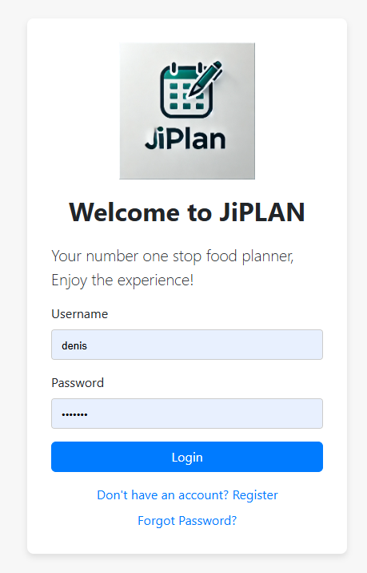

# JiPLaN – JiPLAN: Meal Planning Simplified

## Team Member
- **Denis Bollo**

## Overview

JiPLAN is a web-based meal-planning application designed to simplify meal selection and promote healthy dietary habits. By leveraging randomization and user customization, JiPLAN helps solve the common dilemma of deciding what to eat. The app includes pre-filled food options for breakfast, lunch, and dinner, along with tracking features for daily expenses and recipe information.

## Learning Objectives
- Build intuitive and responsive UI/UX designs using modern tools.
- Strengthen backend skills with **SQLite**, **Flask**, and **RESTful APIs**.
- Explore **user authentication** and **data security mechanisms**.
- Integrate **third-party APIs** to extend app functionality.

## Features

- User Authentication:
  - Login, Registration, and Forgot Password functionality.
  - Secure password hashing using Werkzeug.
- Meal Planning:
  - Pre-filled database of meal options.
  - Customizable meal entries for user-defined preferences.
- Expense Tracking:
  - Tracks daily food expenses for better financial management.
- Recipe Information:
  - Displays recipes for selected meals.

## Technologies Used

### Frontend:
- **HTML**, **CSS**, **JavaScript**
- **Bootstrap** (for styling and responsive design)

### Backend:
- **Flask** (Python web framework)
- **Flask-RESTful API** (for API creation)

### Database:
- **SQLite** / **SQLALCHEMY**

## Third-Party APIs

### Spoonacular API
- **Purpose**: Access to a large database of recipes, meal suggestions, and nutritional details.
- **Use Case**: Pre-fill food options in the app, recommend recipes, and calculate meal nutritional values.
- **Docs**: [Spoonacular API Documentation](https://spoonacular.com/food-api)

### Edamam API
- **Purpose**: Provide nutritional analysis for user meals and recipes.
- **Use Case**: Suggest healthy recipes and account for dietary restrictions (e.g., vegan, gluten-free).
- **Docs**: [Edamam API Documentation](https://developer.edamam.com/)

### Auth0
- **Purpose**: Simplified and secure user authentication.
- **Use Case**: Manage user accounts, login sessions, and social authentication.
- **Docs**: [Auth0 API Documentation](https://auth0.com/docs)

### Google Charts
- **Purpose**: Visualize data like expense trends and meal categories.
- **Use Case**: Create dynamic charts to represent user spending patterns.
- **Docs**: [Google Charts Documentation](https://developers.google.com/chart)

## Setup Instructions
### Prerequisites
Ensure the following are installed:
- Python 3.10+
- pip (Python package manager)
- Git

### Steps
- Clone the Repository:

  `git clone (https://github.com/Bolodenis/Webstack--Portfolio-Project)`
- Navigate to the Project Directory:

  ` cd FINALE_PROJECT`
- Install Dependencies: Install the required Python packages using pip:

  `pip install -r requirements.txt`
- Set Up Environment Variables: Create a .env file in the root directory of the project and add the following variables:

   ` FLASK_APP=app.py
    FLASK_ENV=development
    SECRET_KEY=<your_secret_key>
    DATABASE_URL=sqlite:///model.db `

- Run the Application: Start the Flask development server:

 ` flask run `

- Access the Application: Open a browser and navigate to http://127.0.0.1:5000 to access JiPLAN.

## Contributing
- Fork the repository.
- Create a new branch (git checkout -b feature-name).
- Commit your changes (git commit -am 'Add new feature').
- Push to the branch (git push origin feature-name).
- Open a Pull Request

## License
- License will be done at later stage

## Challenges Already Identified
- **Balancing database size** with prefilled and user-added data.
- Implementing **secure user authentication** and handling sensitive data.
- Ensuring seamless integration of **third-party APIs** with minimal latency.
- Designing a **user-friendly and responsive UI** across devices.
- Debugging authentication issues.
- Managing database schema updates during development.

## Schedule of Work

## API Integration Plan

### Spoonacular API
- **Endpoints**:
  - `/recipes/random` for random meal suggestions.
  - `/recipes/{id}/nutritionWidget.json` for nutritional details.

### Edamam API
- **Endpoints**:
  - `/search` for recipe suggestions.(was to be alternative for Spoonacular API)

### Firebase Cloud Messaging
- **Use Case**: Enable push notifications to remind users about meal plannings.(to be implemented later)

### Google Charts
- **Use Case**: Embed dynamic charts using JavaScript API.

## login section

