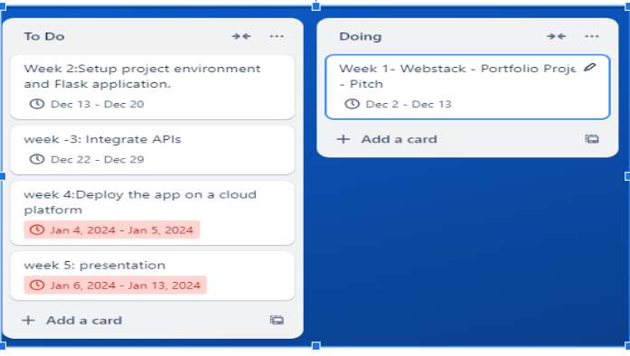

# JiPLaN – Project Overview

## Team Member
- **Denis Bollo**

## About the Project
**JiPLaN** is a meal-planning application designed to simplify meal selection and promote healthy dietary habits. By leveraging randomization and user customization, JiPLaN solves the common dilemma of deciding what to eat. The app includes a pre-filled database of foods and allows users to add their own options. It categorizes meals into breakfast, lunch, dinner, and desserts while enabling users to track daily food expenses for better financial management.

## Learning Objectives
- Build intuitive and responsive UI/UX designs using modern tools.
- Strengthen backend skills with **SQLite**, **Flask**, and **RESTful APIs**.
- Explore **user authentication** and **data security mechanisms**.
- Integrate **third-party APIs** to extend app functionality.

## Technologies Used

### Frontend:
- **HTML**, **CSS**, **JavaScript**
- **Bootstrap** (for styling and responsive design)

### Backend:
- **Flask** (Python web framework)
- **Flask-RESTful API** (for API creation)

### Database:
- **SQLite** / **MySQL**

### Design Tools:
- **Figma** (for mockups)
- **Canva** (for branding and promotional content)

## Third-Party APIs

### Spoonacular API
- **Purpose**: Access to a large database of recipes, meal suggestions, and nutritional details.
- **Use Case**: Pre-fill food options in the app, recommend recipes, and calculate meal nutritional values.
- **Docs**: [Spoonacular API Documentation](https://spoonacular.com/food-api)

### Plaid API
- **Purpose**: Automate expense tracking and categorization.
- **Use Case**: Track daily food expenses, connect to bank accounts, and visualize spending patterns.
- **Docs**: [Plaid API Documentation](https://plaid.com/docs/)

### Edamam API
- **Purpose**: Provide nutritional analysis for user meals and recipes.
- **Use Case**: Suggest healthy recipes and account for dietary restrictions (e.g., vegan, gluten-free).
- **Docs**: [Edamam API Documentation](https://developer.edamam.com/)

### Auth0
- **Purpose**: Simplified and secure user authentication.
- **Use Case**: Manage user accounts, login sessions, and social authentication.
- **Docs**: [Auth0 API Documentation](https://auth0.com/docs)

### Firebase Cloud Messaging (FCM)
- **Purpose**: Push notifications and reminders.
- **Use Case**: Remind users to plan meals, log expenses, and explore new recipes.
- **Docs**: [FCM Documentation](https://firebase.google.com/docs/cloud-messaging)

### Google Charts
- **Purpose**: Visualize data like expense trends and meal categories.
- **Use Case**: Create dynamic charts to represent user spending patterns.
- **Docs**: [Google Charts Documentation](https://developers.google.com/chart)

### Google Maps API
- **Purpose**: Location-based meal suggestions.
- **Use Case**: Suggest nearby restaurants or grocery stores for meal planning.
- **Docs**: [Google Maps API Documentation](https://developers.google.com/maps)

## Challenges Already Identified
- **Balancing database size** with prefilled and user-added data.
- Implementing **secure user authentication** and handling sensitive data.
- Ensuring seamless integration of **third-party APIs** with minimal latency.
- Designing a **user-friendly and responsive UI** across devices.

## Schedule of Work

## API Integration Plan

### Spoonacular API
- **Endpoints**:
  - `/recipes/random` for random meal suggestions.
  - `/recipes/{id}/nutritionWidget.json` for nutritional details.

### Plaid API
- **Endpoints**:
  - `/transactions` for retrieving and categorizing expenses.

### Edamam API
- **Endpoints**:
  - `/search` for recipe suggestions.
  - `/nutrition-details` for meal analysis.

### Firebase Cloud Messaging
- **Use Case**: Enable push notifications to remind users about meal plannings.

### Google Charts
- **Use Case**: Embed dynamic charts using JavaScript API.

### Google Maps API
- **Use Case**: Use geolocation services to find nearby food options.
